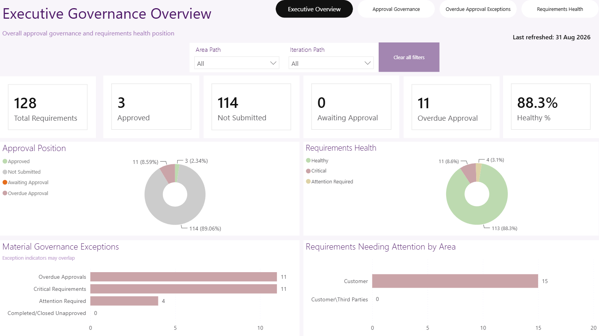
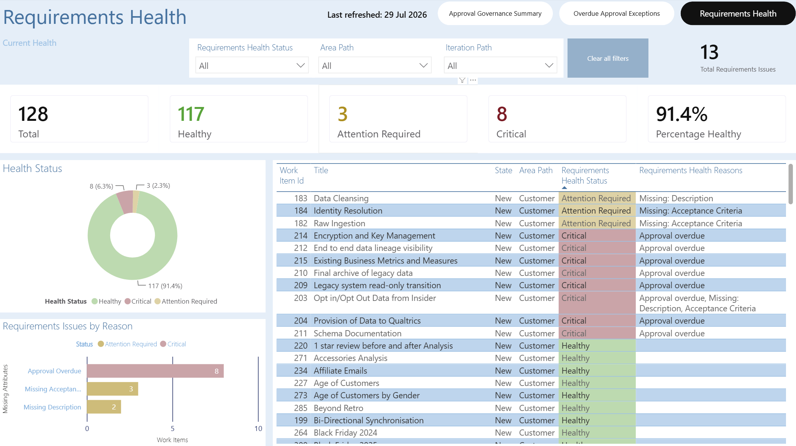

# Power BI Dashboards & User Experience

[← Semantic Model](/projects/azure-devops-governance-analytics/semantic-model/) · [Project Overview](/projects/azure-devops-governance-analytics/) · [Validation & Testing →](/projects/azure-devops-governance-analytics/validation-and-testing/)

## Overview

The reporting layer translates the semantic model into four business-facing Power BI views designed around distinct governance and analytical questions.

The design follows a consistent approach:

- business questions determine the content of each page;
- summary information is presented before supporting detail;
- governance exceptions are made prominent;
- filters and navigation behave consistently;
- operational pages retain the information needed for follow-up;
- status is communicated using labels as well as colour; and
- technical validation is kept separate from normal business navigation.

The completed business-facing report consists of:

1. **Executive Governance Overview**
2. **Approval Governance Summary**
3. **Overdue Approval Exceptions**
4. **Requirements Health**

A separate **Validation / Model Validation** page supports technical assurance and reconciliation.

## Report Design Approach

Each page was designed around the decisions its intended user needs to make rather than around the available fields or visual types.

| Report Page | Primary Purpose | Principal Audience |
|---|---|---|
| **Executive Governance Overview** | Present the overall approval-governance and requirements-health position with material exceptions | Senior stakeholders and governance management |
| **Approval Governance Summary** | Monitor approval workload, overdue position and approval age | Delivery Managers, Project Managers and governance users |
| **Overdue Approval Exceptions** | Identify individual overdue User Stories requiring follow-up | Delivery Managers and Project Managers |
| **Requirements Health** | Assess requirement completeness, health status and issue reasons | Business Analysts and governance users |
| **Validation / Model Validation** | Support technical reconciliation and model assurance | Power BI Developer / Data Analyst |

## Information Hierarchy

The report supports a progression from high-level governance information to actionable detail:

**Executive position**  
↓  
**Approval-governance analysis**  
↓  
**Overdue approval exceptions**  
↓  
**Requirements-health analysis**

The Validation / Model Validation page sits outside this business journey because it exists for technical assurance rather than normal report consumption.

This separation keeps development controls available without adding unnecessary complexity to the business-facing navigation.

## Common User Experience

The principal pages use a consistent visual language and page structure.

Common design elements include:

- clear business-language page titles;
- consistent navigation in the header area;
- visible reporting filters;
- reset controls for returning to the default view;
- prominent KPI cards on summary pages;
- consistent visual containers, alignment and spacing;
- restrained use of colour;
- clear status labels;
- appropriate use of charts for summary analysis;
- tables where record-level follow-up is required; and
- latest reporting or refresh context where applicable.

The intent is that users learn the report structure once and can then move between pages without having to reinterpret the interface.

## Project Evidence

### Executive Governance Overview

*Executive summary of the overall approval-governance and requirements-health position.*

The page presents six headline indicators:

- Total Requirements
- Approved
- Not Submitted
- Awaiting Approval
- Overdue Approval
- Healthy %

The supporting analysis includes:

- **Approval Position**
- **Requirements Health**
- **Material Governance Exceptions**
- **Requirements Requiring Attention by Area**

Area Path and Iteration Path provide the executive reporting scope.

**What this demonstrates:**  
The executive page condenses several underlying analytical populations into a small number of decision-focused indicators while retaining clear routes to the more detailed governance and requirements-health views.

### Executive Design Decisions

Two decisions on this page illustrate how report behaviour was considered alongside visual appearance.

The **Material Governance Exceptions** visual explicitly states:

> **Exception indicators may overlap**

This prevents independent exception measures from being interpreted as one additive population.

The Executive page also deliberately does **not** include a Requirements Health Status slicer. Filtering the executive summary by health status could hide Critical or Attention Required conditions and distort the overall governance picture.

**What this demonstrates:**  
User-experience decisions considered the risk of analytical misinterpretation rather than simply maximising the number of available filters and interactions.

---

### Approval Governance Summary

*Analytical approval-governance view showing current approval workload, overdue position and approval-age indicators.*

The page enables users to answer questions such as:

- how many approval requests are currently active;
- how many are overdue;
- what proportion of active requests is overdue;
- what the typical approval age is;
- how old the oldest request is; and
- how the position changes across the selected reporting scope.

Applicable filters include:

- Area Path;
- Iteration Path;
- Responsible Authoriser; and
- State.

**What this demonstrates:**  
The page translates detailed approval-period logic into reusable management information while allowing users to analyse the position within the relevant organisational or delivery context.

---

### Overdue Approval Exceptions

*Operational exception view presenting the individual User Stories currently meeting the seven-day overdue-approval rule.*

The detail view retains the information required to investigate and prioritise an exception, including:

- User Story identity;
- title;
- Responsible Authoriser;
- approval-period start;
- approval age;
- parent Feature; and
- applicable reporting context.

The table format is used deliberately because the user needs exact record-level information rather than another summary chart.

**What this demonstrates:**  
The reporting journey moves from summary governance information to an actionable population that can support targeted follow-up without requiring users to reconstruct approval history manually in Azure DevOps.

---

### Requirements Health

*Requirements-health view combining overall classification, issue frequency and supporting User Story detail.*

The page presents:

- Total Requirements;
- Healthy Requirements;
- Attention Required Requirements;
- Critical Requirements;
- Healthy Requirements Percentage;
- Total Requirements Issues;
- requirements-health status distribution;
- issues by individual Health Reason; and
- supporting affected-User-Story detail.

Applicable slicers include:

- Requirements Health Status;
- Area Path; and
- Iteration Path.

A reset control restores the page to its default reporting state.

**What this demonstrates:**  
The page separates the number of affected requirements from the number of underlying issues, allowing users to see both the overall health position and the individual reasons requiring investigation.

## Summary-to-Detail Design

The four business-facing pages were designed as complementary views rather than independent dashboards.

| User Question | Reporting Response |
|---|---|
| What is the overall governance position? | Executive Governance Overview |
| Is approval governance under control? | Approval Governance Summary |
| Which approval requests require action? | Overdue Approval Exceptions |
| Which requirements require investigation? | Requirements Health |

This provides a clear analytical progression from **position → analysis → exception → investigation**.

## Navigation Design

The principal navigation is deliberately limited to the four business-facing pages:

**Executive Overview | Approval Governance | Overdue Approval Exceptions | Requirements Health**

The wording and position of the navigation controls remain consistent across those pages.

The Validation / Model Validation page is excluded because it serves a technical assurance purpose rather than a business decision-making purpose.

**What this demonstrates:**  
Navigation was designed around the user journey instead of exposing the internal Power BI page structure directly to the report consumer.

## Filter and Interaction Design

Filters are applied where they contribute to a genuine analytical question rather than being added simply because fields are available.

Representative behaviours include:

| Design Need | Implemented Response |
|---|---|
| Analyse organisational scope | Area Path filtering |
| Analyse delivery scope | Iteration Path filtering |
| Investigate approval responsibility | Responsible Authoriser filtering on approval reporting |
| Investigate requirement health | Requirements Health Status filtering on the Requirements Health page |
| Return quickly to the default view | Clear/reset controls |
| Avoid misleading executive filtering | Requirements Health Status omitted from Executive Overview |
| Avoid confusing chart interactions | Unhelpful visual interactions disabled where necessary |
| Keep navigation predictable | Consistent business-page navigation |

## Visual Selection

Visual types were selected according to the analytical task.

| Analytical Need | Visual Approach |
|---|---|
| Headline value | KPI card |
| Small part-to-whole status distribution | Donut |
| Comparison of governance exceptions | Horizontal bar chart |
| Comparison of individual health reasons | Bar chart |
| Actionable User Story exceptions | Table |
| Technical reconciliation | Validation table |

This avoids using charts where precise record-level information is more useful and avoids tables where a simple visual communicates the overall position more efficiently.

## No-Data and Status Treatment

The report also distinguishes a genuine zero result from an unexplained blank.

Where an applicable KPI has no matching records, the intended behaviour is to display **0** rather than leaving the user to determine whether the visual has failed.

Similarly, status meaning is not communicated by colour alone. Labels such as **Healthy**, **Attention Required** and **Critical** remain visible alongside their visual treatment.

**What this demonstrates:**  
User experience includes the behaviour of the report under edge conditions, not just the appearance of the default populated state.

## Design Outcome

The final report design provides:

- a concise senior governance summary;
- analytical approval-governance monitoring;
- actionable overdue-approval detail;
- objective requirements-health analysis;
- consistent page navigation;
- controlled filtering and reset behaviour;
- summary-to-detail reconciliation;
- readable and consistent presentation; and
- a separate technical validation capability.

The result demonstrates the progression from business requirements and semantic-model capability into a report experience designed around the decisions different users need to make.

## Evidence Presented

The public case study presents selected evidence of:

- all four completed business-facing Power BI pages;
- executive information hierarchy;
- approval-governance analysis;
- actionable overdue-approval reporting;
- requirements-health reporting;
- navigation and filtering decisions;
- visual-selection rationale;
- status and no-data treatment; and
- summary-to-detail report design.

Published screenshots use synthetic, anonymised or sanitised portfolio data. The working Power BI implementation and complete controlled report-design documentation remain within the project environment.

[← Semantic Model](/projects/azure-devops-governance-analytics/semantic-model/) · [Project Overview](/projects/azure-devops-governance-analytics/) · [Validation & Testing →](/projects/azure-devops-governance-analytics/validation-and-testing/)

---

© 2026 Carl Patten. All rights reserved.