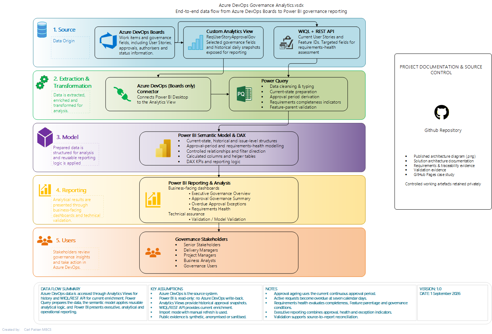

# Solution Architecture

[← Business Problem & Requirements](/projects/azure-devops-governance-analytics/business-problem-and-requirements/) · [Project Overview](/projects/azure-devops-governance-analytics/) · [Data Preparation →](/projects/azure-devops-governance-analytics/data-preparation/)

## Overview

The solution architecture translates the business requirements into a controlled data flow from **Azure DevOps through data preparation and semantic modelling to Power BI reporting**.

A hybrid extraction approach was used because no single Azure DevOps source provided all of the information required by the reporting model.

## Architecture Approach

The solution combines two Azure DevOps data-access methods:

1. **Azure DevOps Analytics View** provides historical work-item snapshots used to reconstruct approval history and determine the current continuous approval period.
2. **WIQL and the Azure DevOps REST API** provide targeted current-state enrichment, including the information required to assess Description and Acceptance Criteria completeness.

The data is then transformed in Power Query, loaded into a controlled semantic model and exposed through the Power BI report layer.

This approach allows historical approval analysis and current requirements-health assessment to coexist without loading unnecessary source content into the final report-facing model.

## Source-to-Report Data Flow

The implemented data flow is:

**Azure DevOps Boards**  
↓  
**Analytics View — historical approval snapshots**  
**WIQL + REST API — current work-item enrichment**  
↓  
**Power Query — cleansing, transformation and current-state preparation**  
↓  
**Power BI Semantic Model — relationships, classifications and DAX measures**  
↓  
**Power BI Report — executive, analytical and operational views**

The report is implemented in **Import mode** and refreshed manually in Power BI Desktop for the portfolio environment.

## Principal Solution Components

| Component | Responsibility |
|---|---|
| **Azure DevOps Boards** | Source work items, approval fields, hierarchy and controlled test scenarios |
| **Azure DevOps Analytics View** | Historical daily approval-state data |
| **WIQL** | Identifies the current work-item population required for targeted enrichment |
| **Azure DevOps REST API** | Retrieves current fields required for requirements-completeness assessment |
| **Power Query** | Cleans, transforms and combines source data; derives current-state and approval-period structures |
| **Semantic Model** | Provides current, historical, approval-period and requirements-health analytical structures |
| **DAX** | Implements dynamic KPIs, approval-age calculations, health measures and executive reporting logic |
| **Power BI Report Layer** | Presents Executive Governance Overview, Approval Governance Summary, Overdue Approval Exceptions and Requirements Health |
| **Validation Layer** | Supports source-to-report reconciliation, controlled scenario testing and model validation |

## Key Architectural Decisions

### Separate Historical and Current-State Data

Historical approval snapshots contain multiple records for each User Story, while current reporting requires one deterministic row per User Story.

The solution therefore separates:

- `ApprovalHistory` — historical daily snapshots; and
- `CurrentApprovals` — one current row per User Story.

This prevents historical records from multiplying current KPI counts while retaining the history needed to reconstruct approval periods.

### Targeted API Enrichment

Description and Acceptance Criteria are required to determine requirements completeness, but retaining the full long-text content in the analytical model was unnecessary.

The REST API is therefore used to derive Boolean completeness indicators rather than loading the raw requirement text into the report-facing model.

This reduces model cardinality and limits unnecessary exposure of source content.

### Separate Requirements-Health Issue Grain

A single User Story can have several health issues.

Story-level health status is therefore maintained separately from `RequirementsHealthReasons`, which stores one row per individual issue reason.

This allows the solution to report both:

- the number of affected User Stories; and
- the total number and distribution of individual issues.

### Controlled Helper Objects

Disconnected helper structures are used where a physical relationship would add unnecessary model complexity.

For example:

- `FeatureWorkItemIDs` validates whether a parent work item is a valid Feature; and
- `Executive Exception Type` supplies the controlled category axis for the Executive material-exception visual.

## Project Evidence

### Implemented Solution Architecture

*Solution architecture showing the implemented flow from Azure DevOps through historical and current-state extraction, Power Query transformation, semantic modelling and Power BI reporting.*

**What this demonstrates:**  
The source design was driven by the analytical requirements rather than by a single preferred extraction method. Historical approval analysis is provided through Azure DevOps Analytics Views, while WIQL and the REST API provide targeted current-state enrichment required for requirements-health assessment.

### Architecture Decision Evidence

| Design Requirement | Architectural Response |
|---|---|
| Historical approval behaviour was required | Daily Azure DevOps Analytics View snapshots retained through `ApprovalHistory` |
| Current reporting required one row per User Story | Separate `CurrentApprovals` structure created |
| Description and Acceptance Criteria completeness had to be assessed | Current work items enriched through WIQL and the Azure DevOps REST API |
| Raw long-text requirement content was unnecessary for reporting | Boolean completeness indicators retained instead of full text |
| A User Story could have multiple health issues | Separate issue-grain `RequirementsHealthReasons` structure implemented |
| Valid Feature parentage had to be checked | Disconnected `FeatureWorkItemIDs` helper structure used |
| Executive exception categories required a controlled axis | Disconnected `Executive Exception Type` presentation helper used |
| KPI results had to reconcile to detailed records | Validation layer retained alongside the business-facing reporting pages |

**What this demonstrates:**  
Each principal architectural component exists to satisfy a specific reporting, data-quality or validation requirement. The model structure was therefore a consequence of the business and analytical rules rather than an arbitrary Power BI design.

## Security and Privacy Considerations

The portfolio architecture deliberately separates public evidence from working implementation artefacts.

Controls include:

- synthetic or anonymised portfolio data;
- exclusion of credentials and tenant-specific configuration;
- sanitised screenshots and documentation;
- exclusion of unnecessary raw Description and Acceptance Criteria text from the report-facing model; and
- retention of working Power BI and source artefacts outside the public portfolio.

## Architecture Outcome

The resulting architecture provides a compact analytical model capable of supporting:

- current approval-governance reporting;
- seven-day overdue approval identification;
- approval-period and approval-age analysis;
- objective requirements-health classification;
- individual health-reason analysis;
- executive governance reporting; and
- controlled KPI-to-detail reconciliation.

The design also demonstrates how different Azure DevOps interfaces can be combined when historical and current-state reporting requirements cannot be satisfied efficiently from a single source.

## Evidence Presented

The public case study presents selected evidence of:

- the implemented high-level solution architecture;
- source-to-report data flow;
- Azure DevOps Analytics View and REST API integration;
- semantic-model design decisions;
- separation of historical, current-state and issue-grain data;
- data-minimisation and privacy controls; and
- validation considerations incorporated into the architecture.

The published architecture diagram is a flattened, watermarked portfolio representation. Editable architecture artefacts and working implementation files are retained within the controlled project environment.

[← Business Problem & Requirements](/projects/azure-devops-governance-analytics/business-problem-and-requirements/) · [Project Overview](/projects/azure-devops-governance-analytics/) · [Data Preparation →](/projects/azure-devops-governance-analytics/data-preparation/)

---

© 2026 Carl Patten. All rights reserved.

